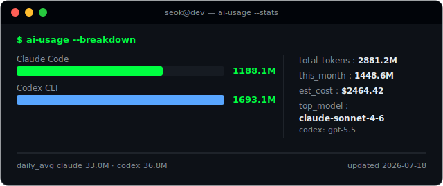
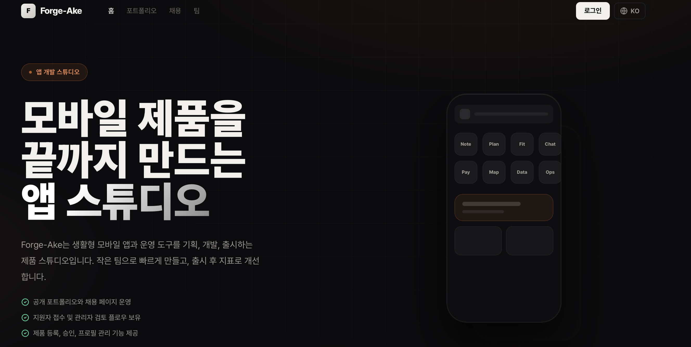

<!--
  ██████╗ ██████╗ ███████╗ ██╗  ██╗
  ██╔══██╗██╔══██╗██╔════╝ ██║ ██╔╝
  ...  프로필 레포: ssk7594-CRz/ssk7594-CRz
  이 파일은 자동으로 일부 갱신됨 (AI USAGE 카드, 잔디 스네이크)
-->

<div align="center">

<!-- [1] 타이핑 애니메이션 헤더 -->
<a href="https://github.com/ssk7594-CRz">
  
</a>

</div>

---

### `~ $ whoami`

```bash
seok@dev:~$ whoami
백엔드 개발자 · Forge-Ake 운영
seok@dev:~$ cat education.txt
Codeit 부트캠프 백엔드(Node.js) 트랙 7기 수료
seok@dev:~$ cat now.txt
Forge-Ake 백엔드·API 설계/운영 중 · AI 페어프로그래밍으로 개발
seok@dev:~$ contact --email
ssk7594@gmail.com
```

---

### `~ $ ai-usage --stats`

<div align="center">
  
</div>

<div align="center">


</div>

---

### `~ $ ./featured-project --run`

```bash
seok@dev:~$ cat forge-ake/README
```

<div align="center">
  <a href="https://forge-ake.com">
    
  </a>
</div>

> **[ Forge-Ake ](https://forge-ake.com)** — 앱 개발 스튜디오 · 개발자 포트폴리오 커뮤니티

취준·인디 개발자가 자기 앱을 포트폴리오로 등록하고, 서로 피드백하고,
"가짜 채용"에 지원해 온라인 명함을 받는 커뮤니티 플랫폼.
**백엔드를 직접 설계·구축·운영** — 인증, 지원자 접수/관리자 검토 API,
제품 등록·승인 워크플로우, 배포와 운영 지표까지.

```text
role   backend · 운영 (API 설계 · DB 모델링 · 인증 · 배포/운영)
stack  Node.js · TypeScript · NestJS · Express · Prisma · PostgreSQL
scope  인증 · 승인 워크플로우 · 관리자 도구 · REST API
```

<div align="center">

[](https://forge-ake.com)

</div>

---

### `~ $ cat stack.txt`

<div align="center">


</div>

---

### `~ $ git log --stat`

<div align="center">


</div>

<!-- [6] 잔디 스네이크 (snake.yml 워크플로가 자동 생성) -->
<div align="center">
  
</div>

---

<div align="center">
  <sub><code>EOF</code> · built with a lot of tokens 🤖</sub>
</div>
